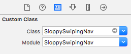

# SloppySwipingNav

A UINavigationController subclass that provides [Sloppy Swiping ](http://thenewsprint.co/2014/04/16/sloppy-swiping/).
It's written in Swift.


## Usage

Just replace `UINavigationController` with `SloppySwipingNav`.

```swift
SloppySwipingNav(rootViewController: controller)
```

If you are using Storyboards, set `SloppySwipingNav` to the Navigation Controller's Custom Class in IB.




## Requirements

Swift 3.0

## Installation

### CocoaPods

To install SloppySwipingNav using through [CocoaPods](http://cocoapods.org), simply add the following line to your Podfile:

```ruby
pod "SloppySwipingNav"
```

### Swift Package Manager

This fork also supports [SPM](https://www.swift.org/package-manager/). To install SloppySwipingNav using SPM, just add following URL as a dependency using Xcode:

```
https://github.com/moridaffy/SloppySwipingNav
```

## Original author

Yuki Mishima, mishimaybe@gmail.com

## License

SloppySwipingNav is available under the MIT license. See the LICENSE file for more info.
